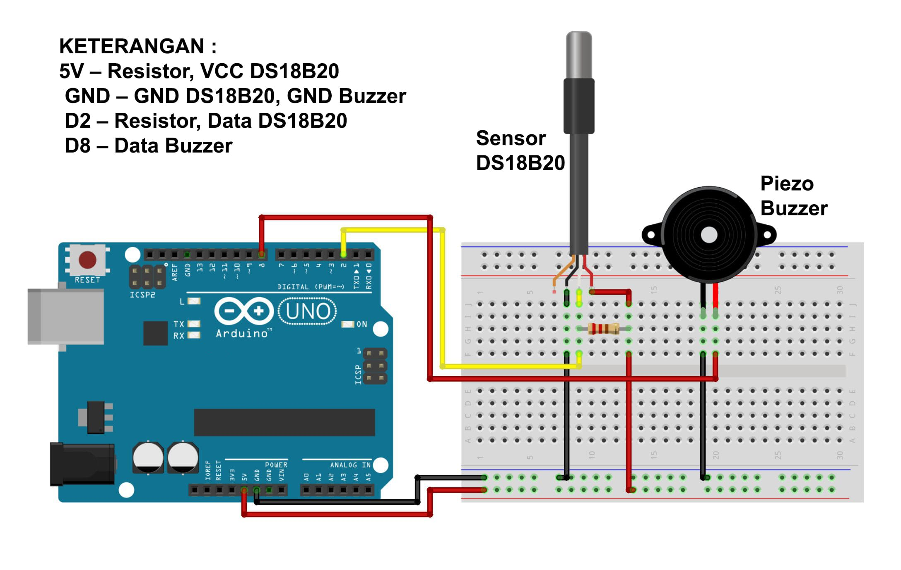

# Temperature Alarm System with DS18B20 and Buzzer

This Arduino project implements a temperature alarm system using the DS18B20 temperature sensor and a buzzer. The system continuously monitors the temperature, and if it exceeds a predefined threshold, an audible alarm is triggered.

## Description

The system reads the temperature using a DS18B20 sensor. If the measured temperature goes above 35°C, the buzzer sounds an alarm to alert the user. The current temperature is displayed in the Serial Monitor.

## Features

- **Real-Time Temperature Monitoring**: Continuously reads temperature from the DS18B20 sensor.
- **Audible Alarm**: Sounds an alarm if the temperature exceeds 35°C.
- **Serial Monitoring**: Outputs the temperature readings to the Serial Monitor.

## Components Required

- Arduino IDE or VS Code;
- Library I2C LCD;
- Library Keypad;
- Arduino (Uno, Mega, or any compatible board) = 1 piece;
- DS18B20 temperature sensor (Waterproof) = 1 piece sensor;
- Piezo Buzzer = 1 piece;
- 4.7kΩ resistor (for DS18B20) or 220Ω = 1 piece;
- Project Board / Breadboard = 1 piece;
- Jumper wires.

# Schematic:

- Below you can see a schematic image to facilitate the wiring of cables from the microcontroller to devices, both input and output sensors:

# Information Pin - Pin :

- ~. 5V – Resistor, VCC DS18B20
- ~. GND – GND DS18B20, GND Buzzer
- ~. D2 – Resistor, Data DS18B20
- ~. D8 – Data Buzze

## Circuit Diagram

- **DS18B20 Data Pin**: Connect to Arduino pin D2.
- **Buzzer**: Connect to Arduino pin D8.

## Work steps

- ~. Prepare the tools and materials to be used.
- ~. Carry out the wiring process using Figure schematic of the above circuit.
- ~. Open the Arduino IDE software that has been installed on laptop/computer.
- ~. Download all the libraries above and insert the libray by opening the Arduino IDE, selecting Sketch -> Include Library -> Add.Zip Library.
- ~. Type the program sketch on the Arduino IDE page.
- ~. Enter the I2C LCD address in the sketch program.
- ~. Carry out the process of uploading the program

## How It Works

1. **Initialization**: The DS18B20 sensor and buzzer are initialized in the `setup()` function.
2. **Temperature Reading**: The temperature is read from the sensor and stored in the variable `t`.
3. **Alarm Trigger**: If the temperature exceeds 35°C, the buzzer will sound for five cycles.
4. **Alarm Function**: The `alarm()` function controls the buzzer's ON/OFF state with delays.

## How to Use

1. **Connect the Components**: Follow the circuit diagram to connect the DS18B20 sensor and buzzer to the Arduino.
2. **Upload the Code**: Upload the provided code to your Arduino board.
3. **Monitor the Temperature**: Open the Serial Monitor to view the current temperature readings.
4. **Alarm Activation**: If the temperature exceeds 35°C, the buzzer will activate to signal the user.

## Code Explanation

- **OneWire and DallasTemperature Libraries**: Used for communication with the DS18B20 sensor.
- **Temperature Monitoring**: The temperature is continuously monitored and printed to the Serial Monitor.
- **Buzzer Control**: The buzzer is activated through the `alarm()` function when the temperature threshold is exceeded.

## Example Serial Output

- Suhu: 29.50°C Suhu: 30.00°C Suhu: 35.50°C Buzzer sounds

## Notes

- Ensure the DS18B20 sensor is correctly connected with a pull-up resistor.
- The temperature threshold can be adjusted in the code as needed.

## Conclusion:

- The program works by detecting water conditions surrounding. If the water temperature exceeds 35 °C or more conditions, the buzzer will sound 5 times.
